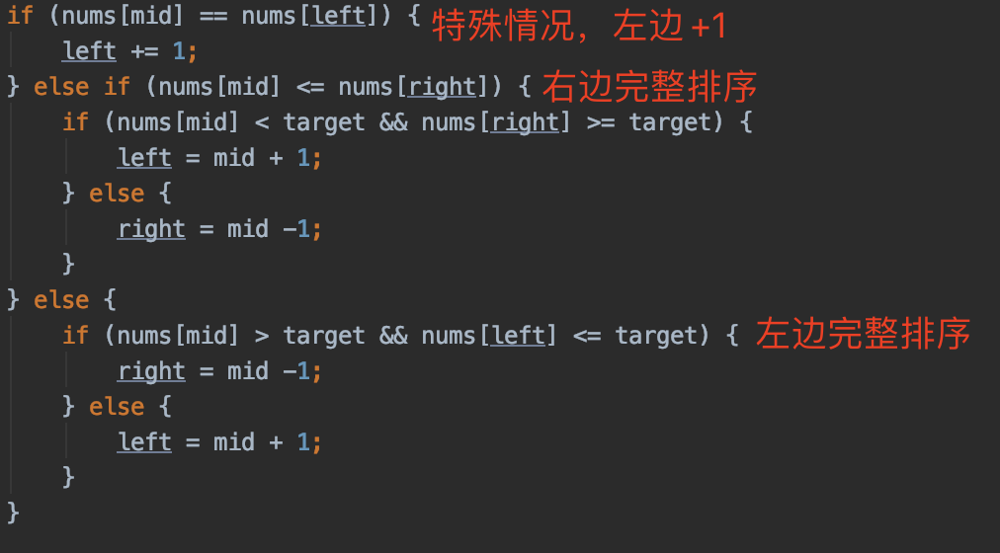

# 81 Search in Rotated Sorted Array II

https://leetcode.com/problems/search-in-rotated-sorted-array-ii/

## Description

There is an integer array `nums` sorted in non-decreasing order (not necessarily with **distinct** values).

Before being passed to your function, `nums` is **rotated** at an unknown pivot index `k` (`0 <= k < nums.length`) such that the resulting array is `[nums[k], nums[k+1], ..., nums[n-1], nums[0], nums[1], ..., nums[k-1]]` (**0-indexed**). For example, `[0,1,2,4,4,4,5,6,6,7]` might be rotated at pivot index `5` and become `[4,5,6,6,7,0,1,2,4,4]`.

Given the array `nums` **after** the rotation and an integer `target`, return `true` *if* `target` *is in* `nums`*, or* `false` *if it is not in* `nums`*.*

You must decrease the overall operation steps as much as possible.

 

## **Example 1:**

```
Input: nums = [2,5,6,0,0,1,2], target = 0
Output: true
```

## **Example 2:**

```
Input: nums = [2,5,6,0,0,1,2], target = 3
Output: false
```

 

## **Constraints:**

- `1 <= nums.length <= 5000`
- `-104 <= nums[i] <= 104`
- `nums` is guaranteed to be rotated at some pivot.
- `-104 <= target <= 104`


## 思路

在一个旋转数组中查找 target是否存在

二分法查找。如果mid <= right ，说明右边大概率是排好序的，只有一种特殊情况，就是左边全部都是相同的数字，例如[2 2 2 1 2 ]。中间为2 右边为2 左边为2。我们首先处理这种特殊情况：特殊情况下，左边+1。



## Java

```java
class Solution {
    public boolean search(int[] nums, int target) {
        int left = 0, right = nums.length -1;
            while (left <= right) {
                int mid = left + (right-left)/2;
                if (nums[mid] == target) {
                    return true;
                }
                if (nums[mid] == nums[left]) {
                    left += 1;
                } else if (nums[mid] <= nums[right]) {
                    if (nums[mid] < target && nums[right] >= target) {
                        left = mid + 1;
                    } else {
                        right = mid -1;
                    }
                } else {
                    if (nums[mid] > target && nums[left] <= target) {
                        right = mid -1;
                    } else {
                        left = mid + 1;
                    }
                }
            }
            return false;
    }
}
```

