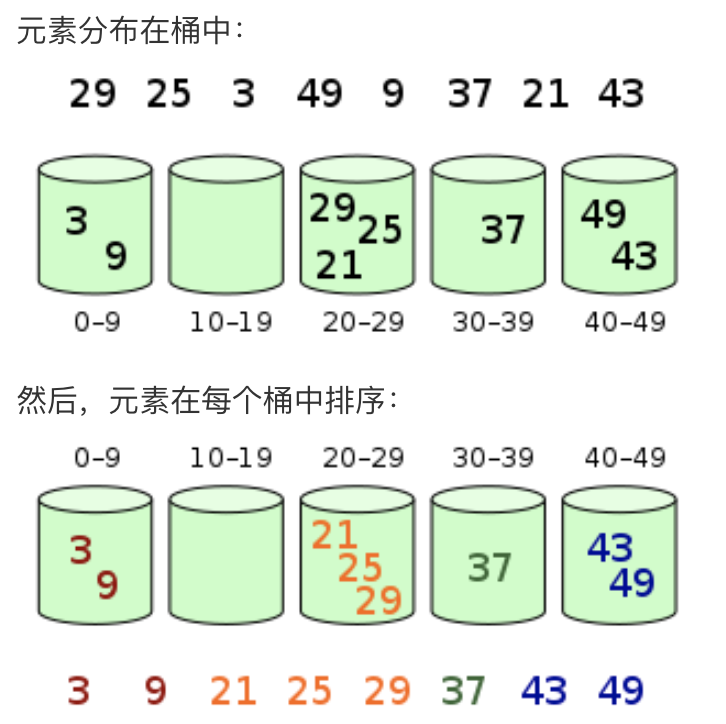

# leetcode
LeetCode刷题笔记。备战面试时，有幸看到谷歌大佬分享的刷题思路，沿用该思路记录自己的刷题历程。

将LeetCode的题目根据解题思路分为以下几类，选取经典题目练习。

## 贪心算法

[455 Assign Cookies(easy)](455/README.md)

[135 Candy](135/README.md)

[435 Non-overlapping Intervals (Medium) ](435/README.md)

## 双指针

[167 Two Sum II - Input array is sorted (Easy) ](167/README.md)

[88 Merge Sorted Array (Easy)](88/README.md)  

[142 Linked List Cycle II (Medium)](142/README.md) 

[76 MinimumWindow Substring (Hard)](76/README.md) 

## 二分

## 排序算法

### 快速排序

选取一个基准值，通常为arr[left]，把数组分为2个部分，左边部分的值都小于基准值，右边部分的值都大于基准值；返回这个分割index。然后对于left,index-1   index+1,right 这2个数组继续用该思路排序。

```java
void quickSort(int[] arr, int left, int right) {
    if (left < right) {
        int pivot = arr[left];
        int pivotIndex = left + 1;
        for (int i=left+1; i<=right; i++) {
            if (arr[i] < pivot) {
                swap(arr, i, pivotIndex);
                pivotIndex += 1;
            }
        }
        pivotIndex -= 1;
        swap(arr, left, pivotIndex);
        quickSort(arr, left, pivotIndex-1);
        quickSort(arr, pivotIndex+1, right);
    }
}

```

### 归并排序

1. 申请空间，使其大小为两个已经排序序列之和，该空间用来存放合并后的序列；
2. 设定两个指针，最初位置分别为两个已经排序序列的起始位置；
3. 比较两个指针所指向的元素，选择相对小的元素放入到合并空间，并移动指针到下一位置；
4. 重复步骤 3 直到某一指针达到序列尾；
5. 将另一序列剩下的所有元素直接复制到合并序列尾。

```java
// 不断划分，直到数组只剩下一个元素。这个数组是已排序的最小单元
// 然后merge
void mergeSort(int[] arr) {
    if (arr.length < 2) {
        return;
    }
    int l=0, r=arr.length;
    int mid= l + (r-l)/2;
    int[] left = Arrays.copyOfRange(arr, l, mid);
    int[] right = Arrays.copyOfRange(arr, mid, r);
    mergeSort(left);
    mergeSort(right);
    int[] temp = merge(left, right);
    for (int i=0; i<temp.length; i++) {
        arr[i] = temp[i];
    }
}

int[] merge(int[] left, int[] right) {
    int[] result = new int[left.length + right.length];
    int i=0, j=0;
    int index = 0;
    while (i<left.length && j<right.length) {
        if (left[i] < right[j]) {
            result[index++] = left[i++];
        } else {
            result[index++] = right[j++];
        }
    }
    for (;i<left.length;) {
        result[index++] = left[i++];
    }
    for(;j<right.length;) {
        result[index++] = right[j++];
    }
    return result;
}
```

### 桶排序



1. 额外空间充足的情况下，尽量增大桶的数量
2. 使用的映射函数能够将输入的N个数均匀分配到K个桶中

### 冒泡排序

### 选择排序

### 插入排序

## 搜索算法

### DFS(深度优先)

### 回溯法

### BFS(广度优先)

## 动态规划

### 背包问题


