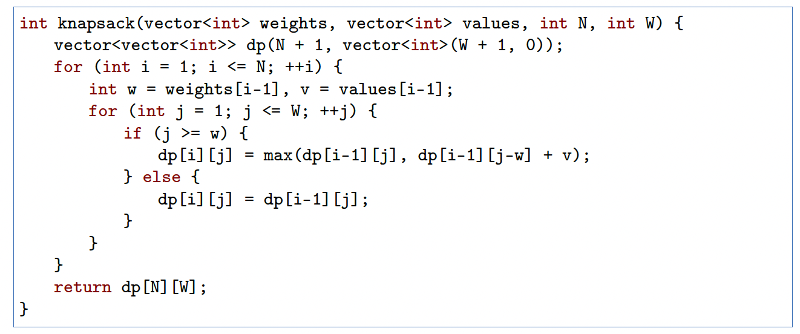
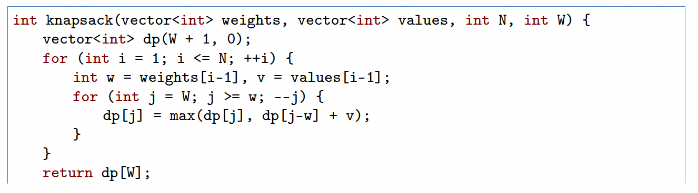
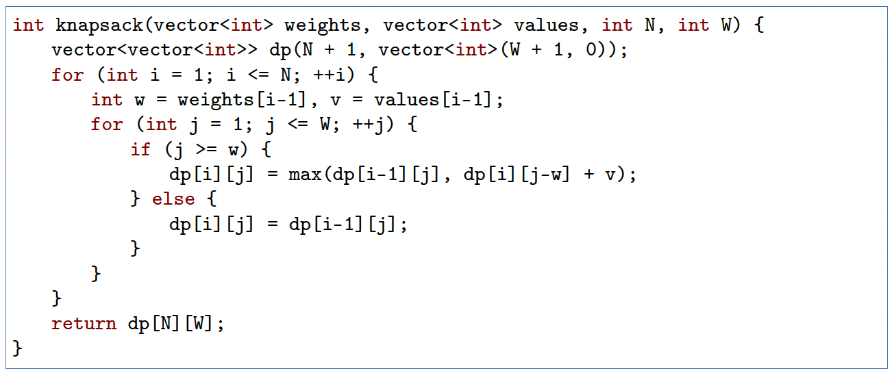

# leetcode

LeetCode刷题笔记。备战面试时，有幸看到谷歌大佬分享的刷题思路，沿用该思路记录自己的刷题历程。

将LeetCode的题目根据解题思路分为以下几类，选取经典题目练习。

## 贪心算法

[455 Assign Cookies(easy)](455/README.md)

[135 Candy](135/README.md)

[435 Non-overlapping Intervals (Medium) ](435/README.md)

## 双指针

[167 Two Sum II - Input array is sorted (Easy) ](167/README.md)

[88 Merge Sorted Array (Easy)](88/README.md)  

[142 Linked List Cycle II (Medium)](142/README.md) 

[76 MinimumWindow Substring (Hard)](76/README.md) 

## 二分

[ 69 Sqrt(x) (Easy)](69/README.md) 

[ 34 Find First and Last Position of Element in Sorted Array (Medium)](34/README.md) 

[81 Search in Rotated Sorted Array II (Medium)](81/README.md)


## 排序算法

### 快速排序

选取一个基准值，通常为arr[left]，把数组分为2个部分，左边部分的值都小于基准值，右边部分的值都大于基准值；返回这个分割index。然后对于left,index-1   index+1,right 这2个数组继续用该思路排序。

```java
void quickSort(int[] arr, int left, int right) {
    if (left < right) {
        int pivot = arr[left];
        int pivotIndex = left + 1;
        for (int i=left+1; i<=right; i++) {
            if (arr[i] < pivot) {
                swap(arr, i, pivotIndex);
                pivotIndex += 1;
            }
        }
        pivotIndex -= 1;
        swap(arr, left, pivotIndex);
        quickSort(arr, left, pivotIndex-1);
        quickSort(arr, pivotIndex+1, right);
    }
}

```

### 归并排序

1. 申请空间，使其大小为两个已经排序序列之和，该空间用来存放合并后的序列；
2. 设定两个指针，最初位置分别为两个已经排序序列的起始位置；
3. 比较两个指针所指向的元素，选择相对小的元素放入到合并空间，并移动指针到下一位置；
4. 重复步骤 3 直到某一指针达到序列尾；
5. 将另一序列剩下的所有元素直接复制到合并序列尾。

```java
// 不断划分，直到数组只剩下一个元素。这个数组是已排序的最小单元
// 然后merge
void mergeSort(int[] arr) {
    if (arr.length < 2) {
        return;
    }
    int l=0, r=arr.length;
    int mid= l + (r-l)/2;
    int[] left = Arrays.copyOfRange(arr, l, mid);
    int[] right = Arrays.copyOfRange(arr, mid, r);
    mergeSort(left);
    mergeSort(right);
    int[] temp = merge(left, right);
    for (int i=0; i<temp.length; i++) {
        arr[i] = temp[i];
    }
}

int[] merge(int[] left, int[] right) {
    int[] result = new int[left.length + right.length];
    int i=0, j=0;
    int index = 0;
    while (i<left.length && j<right.length) {
        if (left[i] < right[j]) {
            result[index++] = left[i++];
        } else {
            result[index++] = right[j++];
        }
    }
    for (;i<left.length;) {
        result[index++] = left[i++];
    }
    for(;j<right.length;) {
        result[index++] = right[j++];
    }
    return result;
}
```

### 桶排序


1. 额外空间充足的情况下，尽量增大桶的数量
2. 使用的映射函数能够将输入的N个数均匀分配到K个桶中

### 冒泡排序

1. 比较相邻的元素。如果第一个比第二个大，就交换他们两个。
2. 对每一对相邻元素作同样的工作，从开始第一对到结尾的最后一对。这步做完后，最后的元素会是最大的数。
3. 针对所有的元素重复以上的步骤，除了最后一个。
4. 持续每次对越来越少的元素重复上面的步骤，直到没有任何一对数字需要比较。

```java
void bubbleSort(int[] arr) {
    for (int i=0; i<arr.length-1; i++) {
        boolean swap = false;
        for (int j=1; j<arr.length-i;j++) {
            if (arr[j-1] > arr[j]) {
                swap(arr, j-1 , j);
                swap = true;
            }
        }
        if (!swap) {
            break;
        }
    }
}
```

### 选择排序

1. 首先在未排序序列中找到最小（大）元素，存放到排序序列的起始位置。
2. 再从剩余未排序元素中继续寻找最小（大）元素，然后放到已排序序列的末尾。
3. 重复第二步，直到所有元素均排序完毕。

```java
void selectionSort(int[] arr) {
    for (int i=0; i<arr.length-1; i++) {
        int minIndex = i;
        for (int j=i+1; j<arr.length; j++) {
            if (arr[j] < arr[minIndex]) {
                minIndex = j;
            }
        }
        swap(arr, i, minIndex);
    }
}
```

### 插入排序

将第一待排序序列第一个元素看做一个有序序列，把第二个元素到最后一个元素当成是未排序序列。从头到尾依次扫描未排序序列，将扫描到的每个元素插入有序序列的适当位置。

插入的时候，对于排序的数组进行倒序遍历，直接进行交换，从而把未排序的元素传送到合适的位置。

```java
void insertSort(int[] arr) {
    for (int i=1; i<arr.length; i++) {
        int index = i;
        int current = arr[i];
        for (int j=i-1; j>=0;j--) {
            if (arr[j] > current) {
                swap(arr, index, j);
                index -=1;
            } else {
                break;
            }
        }
    }
}
```


[215 Kth Largest Element in an Array (Medium) ](215/README.md)

[347 Top K Frequent Elements (Medium)](347/README.md)

### 

## 搜索算法

### DFS(深度优先)

深度优先搜索 depth-first seach DFS 在搜索到一个新的节点时，立即对新节点进行遍历。因此遍历用先入后出的栈来实现，也可以用与栈等价的递归来实现。对于树结构，由于总是对新节点调用遍历，因此看起来是向着“深”的方向前进。

### BFS(广度优先)

广度优先搜索（breadth-first search，BFS）不同与深度优先搜索，它是一层层进行遍历的，因此需要用先入先出的队列而非先入后出的栈进行遍历。由于是按层次进行遍历，广度优先搜索时按照“广”的方向进行遍历的，也常常用来处理最短路径等问题。

### 回溯法

回溯法 backtracking 是优先搜索的一种特殊情况。又称为试探法，常用于记录节点状态的深度优先搜索。通常来说，排列、组合、选择类问题使用回溯法比较方便。

顾名思义，回溯法的核心是回溯。在搜索到某一节点的时候 如果我们发现目前的节点及其子 节点并不是所求目标时，我们回溯到原来的节点继续搜索 并且把在目前节点修改的状态还原。

[695 Max Area of Island (Easy)](695/README.md)

[417 Pacific AtlanticWater Flow (Medium)](417/README.md)

[547 Number of Provinces(Medium)](547/README.md)

[46 Permutations (Medium)](46/README.md)

[77 Combinations (Medium)](77/README.md)

[79 Word Search (Medium)](79/README.md)

[51 N-Queens (Hard)](51/README.md)

[934 Shortest Bridge (Medium)](934/README.md)

[131 Palindrome Partitioning(Medium)](131/README.md)

[127 Word Ladder(hard)](127/README.md)


## 动态规划

通俗一点来讲，动态规划和其它遍历算法（如深/广度优先搜索）都是将原问题拆成多个子问题然后求解，他们之间最本质的区别是，动态规划保存子问题的解，避免重复计算。解决动态规划问题的关键是找到状态转移方程，这样我们可以通过计算和储存子问题的解来求解最终问题。在一些情况下，动态规划可以看成是带有状态记录（memoization）的优先搜索。状态记录的意思为，如果一个子问题在优先搜索时已经计算过一次，我们可以把它的结果储存下来，之后遍历到该子问题的时候可以直接返回储存的结果。


[70 Climbing Stairs (Easy)](70/README.md)

[198 House Robber (Easy)](198/README.md)

[413 Arithmetic Slices (Medium)](413/README.md)

[64 Minimum Path Sum (Medium)](64/README.md)

[542 01 Matrix (Medium)](542/README.md)

[221 Maximal Square (Medium)](221/README.md)

[279 Perfect Squares (Medium) ](279/README.md)

[91 Decode Ways (Medium)](91/README.md)

[139 Word Break (Medium)](139/README.md)

[300 Longest Increasing Subsequence (Medium)](300/README.md)

[1143 Longest Commom Subsequence (Medium)](1143/README.md)

### 背包问题

背包问题是一种组合优化的NP 完全问题：有N 个物品和容量为W 的背包，每个物品都有自己的体积w 和价值v，求拿哪些物品可以使得背包所装下物品的总价值最大。如果限定每种物品只能选择0 个或1 个，则问题称为0-1 背包问题；如果不限定每种物品的数量，则问题称为无界背包问题或完全背包问题。

我们可以用动态规划来解决背包问题。以0-1 背包问题为例。我们可以定义一个二维数组dp存储最大价值，其中dp[i][j] 表示前i 件物品体积不超过j 的情况下能达到的最大价值。在我们遍历到第i 件物品时，在当前背包总容量为j 的情况下，如果我们不将物品i 放入背包，那么dp[i][j]= dp[i-1][j]，即前i 个物品的最大价值等于只取前i-1 个物品时的最大价值；如果我们将物品i 放入背包，假设第i 件物品体积为w，价值为v，那么我们得到dp[i][j] = dp[i-1][j-w] + v。我们只需在遍历过程中对这两种情况取最大值即可，总时间复杂度和空间复杂度都为O(NW)。



我们可以进一步对0-1 背包进行空间优化，将空间复杂度降低为O.W.。如图所示，假设我们目前考虑物品i = 2，且其体积为w = 2，价值为v = 3；对于背包容量j，我们可以得到dp[2][j]= max(dp[1][j], dp[1][j-2] + 3)。这里可以发现我们永远只依赖于上一排i = 1 的信息，之前算过的其他物品都不需要再使用。因此我们可以去掉dp 矩阵的第一个维度，在考虑物品i 时变成dp[j]= max(dp[j], dp[j-w] + v)。这里要注意我们在遍历每一行的时候必须逆向遍历，这样才能够调用上一行物品i-1 时dp[j-w] 的值；若按照从左往右的顺序进行正向遍历，则dp[j-w] 的值在遍历到  j 之前就已经被更新成物品i 的值了。



在完全背包问题中，一个物品可以拿多次。这样，我们就得到了完全背包问题的状态转移方程：dp[i][j] = max(dp[i-1][j], dp[i][j-w] + v)，其与0-1 背包问题的差别仅仅是把状态转移方程中的第二个i-1 变成了i。

同样的，我们也可以利用空间压缩将时间复杂度降低为O(W)。这里要注意我们在遍历每一

行的时候必须正向遍历，因为我们需要利用当前物品在第j-w 列的信息。


[416 Partition Equal Subset Sum (Medium)](416/README.md)

[474 Ones and Zeroes (Medium)](474/README.md)

[322 Coin Change (Medium)](322/README.md)

[72 Edit Distance (Hard)](72/README.md)

[650 2 Keys Keyboard (Medium)](650/README.md)

[10 Regular Expression Matching (Hard)](10/README.md)

[121 Best Time to Buy and Sell Stock (Easy) ](121/README.md)

[122 Best Time to Buy and Sell Stock II(Medium)](122/README.md)

[188 Best Time to Buy and Sell Stock IV(hard)](188/README.md)

[309 Best Time to Buy and Sell Stock with Cooldown (Medium)](309/README.md)


## 分治法


[](README.md)

